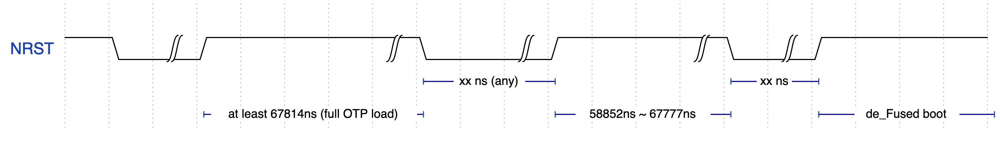

# wii_u_modchip

A (WIP) Wii U modchip based on de_Fuse, a flaw in the Wii U's OTP eFuse readout state machine.

## How does it work?
A full writeup is available [here](https://douevenknow.us/post/714056575412764672/defuse-the-one-true-pwn). However, the short version is as follows:

In order to accommodate eFuse-based JTAG lockout (and due to other considerations), eFuse bits must be buffered into a register file immediately following NRST, before the internal reset can be released. The eFuse sense state machine latches at a rate of 4 bits per cycle, directly off the 27MHz XTALCLK. Every other rising edge, a byte is written into the register file, starting from the least significant byte of the current u32.

An internal counter is used to keep track of the remaining bytes to be read into the register file. While the eFuse register file is reset to zero with NRST, the internal counter is not: By asserting NRST after N bytes have been read, only 0x400-N bytes will be read on the subsequent boot.

By asserting NRST just before the final byte has been read (1830 cycles), all eFuses will read entirely zero, including the JTAG lockout fuse. This allows trivial, unsigned and unencrypted boot1 execution, with no SEEPROM anti-rollback.

